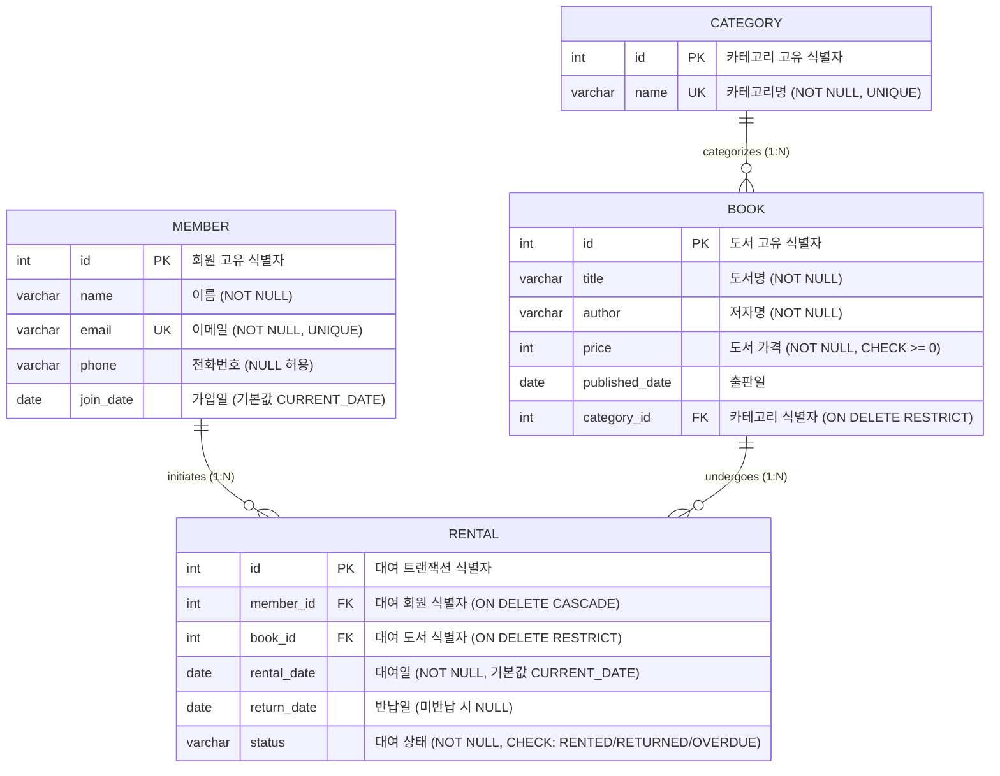
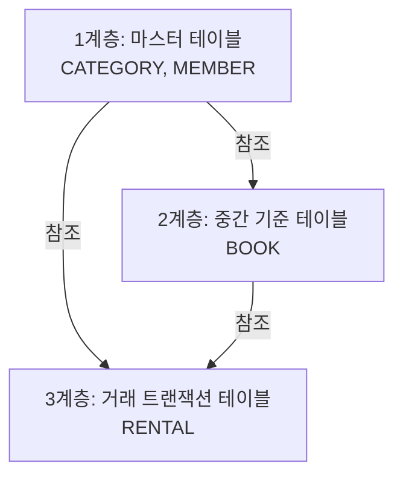

# 📚 SQL로 만드는 나만의 도서 대여 데이터베이스 (GLAD)

> **"데이터베이스는 단순한 엑셀 파일이 아닙니다. 데이터 간의 '관계'를 안전하고 일관되게 다루기 위한 약속입니다."**

이 프로젝트는 백엔드 프레임워크나 외부 라이브러리 없이, 순수 SQL 스크립트만으로 도서 대여 시스템을 위한 관계형 데이터베이스(RDBMS)를 설계하고 데이터 구축, 핵심 비즈니스 쿼리 작성, 성능 최적화(인덱싱) 및 비즈니스 의사결정을 위한 리포트 쿼리까지 수행한 종합 포트폴리오입니다.

데이터베이스를 처음 접하는 동료도 원리를 쉽게 이해할 수 있도록, 데이터 모델링의 기초부터 SQL 엔진의 내부 동작 메커니즘까지 상세하게 정리했습니다.

---

## 💡 1. 엑셀(Excel)과 RDBMS의 결정적 차이

"데이터가 많아지면 데이터베이스를 써야 한다"는 말은 반만 맞습니다. 엑셀과 RDBMS의 본질적인 차이는 **'데이터 정합성(Consistency)과 관계(Relation)를 강제할 수 있는가'**에 있습니다.

| 구분 | 📊 스프레드시트 (Excel) | 🗄️ 관계형 데이터베이스 (RDBMS) |
| :--- | :--- | :--- |
| **데이터 타입 강제** | 한 열(Column)에 숫자, 문자, 날짜를 마구 섞어 써도 막을 수 없어 데이터가 쉽게 오염됩니다. | 테이블 정의 단계에서 정해진 형식(`VARCHAR`, `INTEGER`, `DATE` 등)과 제약조건(`CHECK`)에 맞는 데이터만 저장을 허용합니다. |
| **중복 데이터 관리** | '문학/소설'이라는 장르명을 책마다 반복 기재합니다. 장르 이름이 바뀌면 수백 행을 찾아 직접 수정해야 하며(수정 이상), 오타가 나면 분류 체계가 깨집니다. | 장르를 `CATEGORY` 테이블로 분리(정규화)한 뒤, `BOOK` 테이블에서는 해당 카테고리의 고유 ID만 참조(FK)합니다. 장르 이름이 바뀌어도 단 1곳만 수정하면 반영됩니다. |
| **참조 무결성 보장** | 가입하지 않은 회원이 책을 빌려 가거나, 존재하지 않는 책을 대여하는 비논리적인 상황을 엑셀 자체적으로 막을 수 없습니다. | 외래키(Foreign Key) 제약조건을 통해 가입된 회원(`MEMBER`)과 실재하는 책(`BOOK`)의 ID만 대여 기록(`RENTAL`)에 등록될 수 있도록 차단합니다. |
| **동시성 및 트랜잭션** | 여러 명이 동시에 파일을 열고 수정하면 최신 입력이 날아가거나(갱신 분실) 파일이 잠깁니다. 시스템이 꺼지면 저장 중이던 파일이 손상될 수 있습니다. | 행 단위 잠금(Row-level Lock)으로 수천 명의 동시 접근을 병렬 처리하며, ACID 트랜잭션과 WAL(Write-Ahead Log) 덕분에 시스템 장애 시에도 완벽한 복구를 보장합니다. |

---

## 🗺️ 2. 데이터베이스 모델링 및 ERD

본 도서 대여 데이터베이스는 **분류(Category), 회원(Member), 도서(Book), 대여(Rental)**의 4대 핵심 엔티티를 도출하여 구축되었습니다.

### 📊 Entity Relationship Diagram (ERD)



### 🤝 테이블 간 1:N 관계 설명

1. **CATEGORY (1) : BOOK (N)**  
   * 한 카테고리(예: 컴퓨터과학) 아래에는 여러 권의 책이 귀속될 수 있습니다. 
   * `BOOK` 테이블의 `category_id` 컬럼이 `CATEGORY` 테이블의 `id`를 가리켜 소속 관계를 표현합니다.
2. **MEMBER (1) : RENTAL (N)**  
   * 한 명의 회원은 가입 기간 동안 여러 차례 도서를 대여할 수 있습니다.
   * `RENTAL` 테이블의 `member_id` 컬럼이 `MEMBER` 테이블의 `id`를 참조하여 대여 기록의 주체를 특정합니다.
3. **BOOK (1) : RENTAL (N)**  
   * 한 권의 책은 시간이 흐르며 대여와 반납을 반복하여 여러 번의 대여 트랜잭션에 기여할 수 있습니다.
   * `RENTAL` 테이블의 `book_id` 컬럼이 `BOOK` 테이블의 `id`를 참조합니다.

---

## 🛠️ 3. 데이터 무결성(Integrity)과 제약조건 설정

비즈니스 규칙을 백엔드 개발자의 소스코드에만 의존해 검증하면 버그나 누락으로 잘못된 데이터가 DB에 쌓일 수 있습니다. 본 데이터베이스는 **엔진 단에서 정합성을 절대적으로 지키도록 제약조건을 명시**했습니다.

* **개체 무결성 (Primary Key)**: 모든 테이블에 `id INTEGER PRIMARY KEY AUTOINCREMENT`를 지정하여 데이터 행이 고유하게 식별되도록 보장합니다.
* **도메인 무결성 (NOT NULL / UNIQUE / CHECK)**:
  * `NOT NULL`: 회원명, 이메일, 도서명 등 필수 비즈니스 데이터의 누락을 원천 차단합니다.
  * `UNIQUE`: 동일한 장르명(`CATEGORY.name`)이 두 번 저장되거나, 동일한 이메일(`MEMBER.email`)로 중복 가입하는 것을 방지합니다.
  * `CHECK`: 도서 가격이 음수가 되지 않도록 규정하고(`price >= 0`), 대여 상태(`status`)는 오직 `'RENTED'`, `'RETURNED'`, `'OVERDUE'` 셋 중 하나만 입력될 수 있도록 강제합니다.
* **참조 무결성 (Foreign Key)**:
  * SQLite 특성상 세션 시작 시 `PRAGMA foreign_keys = ON;` 명령을 무조건 실행해 외래키 엔진을 활성화합니다.
  * **`ON DELETE RESTRICT` (참조 무결성 방어)**:
    * `CATEGORY` 삭제 시: 해당 카테고리에 속한 도서(`BOOK`)가 존재한다면 카테고리 삭제를 거부합니다.
    * `BOOK` 삭제 시: 과거에 해당 책을 빌려 간 대여 이력(`RENTAL`)이 있다면 책 정보 삭제를 거부합니다. (결산 및 히스토리 보존 목적)
  * **`ON DELETE CASCADE` (연쇄 삭제 처리)**:
    * `MEMBER` 탈퇴 시: 회원이 탈퇴하면 그 회원의 모든 대여 기록(`RENTAL`)이 동반 삭제됩니다. *(단, 실무에서는 금융/세무상 거래 이력을 유지하기 위해 아래에 설명하는 **소프트 딜리트(Soft Delete)** 방식을 쓰는 것이 훨씬 안전합니다.)*

---

## 📥 4. 샘플 데이터 적재 아키텍처

외래키 제약조건이 걸려 있는 시스템에서는 아무 테이블이나 먼저 데이터를 넣을 수 없습니다. 데이터 간의 **참조 종속성 계층(Referential Dependency Hierarchy)**을 고려해 데이터를 삽입해야 에러가 발생하지 않습니다.



1. **1계층 (독립 데이터)**: `CATEGORY`(10행), `MEMBER`(11행)  
   * 다른 테이블을 참조하지 않으므로 가장 먼저 생성하고 데이터를 삽입합니다.
2. **2계층 (1차 종속 데이터)**: `BOOK`(11행)  
   * 생성된 `CATEGORY.id` 중 하나를 반드시 가지고 있어야 하므로, `CATEGORY` 적재 후에 삽입합니다.
3. **3계층 (2차 종속 데이터)**: `RENTAL`(15행)  
   * 빌리는 회원(`MEMBER`)과 빌려주는 책(`BOOK`)이 모두 실재해야 하므로 가장 마지막에 적재합니다.

---

## 🔍 5. 핵심 SQL 쿼리 15선 및 작동 분석 (`queries.sql`)

SQL 엔진은 쿼리가 작성된 순서가 아니라, 내부의 논리적 실행 순서(Logical Query Processing)에 따라 데이터를 가공합니다.

> **💡 논리적 쿼리 실행 순서:**  
> `FROM` (+ JOIN) ➡️ `WHERE` ➡️ `GROUP BY` ➡️ `HAVING` ➡️ `SELECT` ➡️ `DISTINCT` ➡️ `ORDER BY` ➡️ `LIMIT`

### 쿼리 리스트 요약

#### 1. 기본 조회 쿼리 (Part A)
* **Query 1 (정렬)**: 전체 회원 목록 조회 (가입일 오래된 순)
* **Query 2 (필터링 + 정렬)**: 20,000원 이상 고가 도서 목록 조회 (가격 내림차순)
* **Query 3 (패턴 매칭 + 정렬 + LIMIT)**: 특정 도메인(`@example.com`) 회원 중 최근 가입자 5명 추출 (검색 페이징의 기본)
* **Query 4 (정렬)**: 전체 카테고리 목록을 장르 이름 사전순으로 나열

#### 2. 테이블 조인 쿼리 (Part B)
* **Query 5 (3자 INNER JOIN)**: 현재 도서를 미반납(대여 중/연체 중) 상태로 가지고 있는 회원명과 도서명 결합 조회
* **Query 6 (INNER JOIN + 필터)**: 특정 회원(이영희, ID=1)의 전체 대여 이력 및 책 상세 조회
* **Query 7 (LEFT OUTER JOIN + COUNT + GROUP BY)**: 대여 횟수가 0인 책(`Java의 정석` 등)을 포함해 모든 책의 누적 대여 횟수 집계
* **Query 8 (LEFT OUTER JOIN + ON 다중 조건)**: 현재 책을 대여 중이지 않은 회원(NULL)까지 포함한 전체 회원의 실시간 대여 현황 조회

#### 3. 집계 및 그룹화 쿼리 (Part C)
* **Query 9 (GROUP BY + COUNT + AVG)**: 카테고리별 도서 권수와 평균 가격(소수점 첫째 자리 반올림) 산출
* **Query 10 (GROUP BY + COUNT + SUM)**: 회원별 누적 대여 횟수 및 빌려 간 책들의 총 가치 합계 조회 (우수 회원 선별용)
* **Query 11 (GROUP BY + COUNT)**: 도서관 내 대여 건의 상태 분포(정상반납/대여중/연체중) 집계

#### 4. 서브쿼리 활용 쿼리 (Part D)
* **Query 12 (비교 스칼라 서브쿼리)**: 전체 도서 평균 가격보다 비싼 책들만 동적으로 필터링하여 조회
* **Query 13 (상관 NOT EXISTS 서브쿼리)**: 가입만 하고 책을 단 한 번도 빌리지 않은 휴면 회원 목록 추출 (Early Exit 최적화를 통해 성능 향상)

#### 5. 데이터 수정 및 삭제 쿼리 (Part E)
* **Query 14 (날짜 연산 벌크 UPDATE)**: 대여일로부터 14일이 경과했으나 반납되지 않은 책들을 `julianday()` 날짜 연산을 통해 `OVERDUE` 상태로 일괄 변경
* **Query 15 (DELETE + CASCADE 검증)**: 임시 회원을 추가하고 대여 기록을 삽입한 뒤, 회원을 지웠을 때 대여 기록까지 함께 연쇄 삭제되는 무결성 작동 검증

#### 6. 인덱스 생성 (Part F)
* **Query 16 (인덱스 생성)**: RENTAL 테이블의 `status` 컬럼에 B-Tree 인덱스 `idx_rental_status` 구축.
  * **이유**: 실시간 미반납 현황(`WHERE status IN ('RENTED', 'OVERDUE')`) 쿼리의 빈도가 매우 높기 때문에 Full Table Scan($O(N)$)을 지양하고 Index Range Scan($O(\log N)$)으로 성능을 고도화하기 위함.

---

## 🏆 6. 보너스 과제 심층 분석 (`bonus_queries.sql`)

### 5.1 JOIN vs Subquery 성능 및 실행 계획 비교
* **요구사항**: "사피엔스" 도서를 빌려 간 이력이 있는 회원 조회
* **JOIN 방식**: `MEMBER m INNER JOIN RENTAL r ... INNER JOIN BOOK b WHERE b.title = '사피엔스'`
* **Subquery 방식**: `WHERE id IN (SELECT member_id FROM RENTAL WHERE book_id = (SELECT id FROM BOOK WHERE title = '사피엔스'))`
* **비교 분석**: 
  * 데이터 집합이 작을 때는 두 쿼리 모두 매우 빠릅니다. 
  * 그러나 대용량 데이터 환경에서 **JOIN**은 정렬 및 병합(Sort-Merge) 혹은 해시(Hash) 연산으로 두 테이블을 다이렉트로 붙여 최적의 속도를 냅니다.
  * **Subquery(IN)**는 안쪽 쿼리가 먼저 단일 집합을 반환하고 바깥 쿼리가 필터링을 하는 단계적 구조를 가집니다. 최신 DBMS 엔진(Optimizer)은 서브쿼리를 내부적으로 조인 형태로 최적화(Subquery Unnesting)하여 실행하지만, 오래된 엔진이나 복잡한 쿼리에서는 서브쿼리가 바깥 행마다 계속 반복 실행되는 서브쿼리 루프 비효율을 낳을 수 있어 가급적 조인으로 구현하는 것이 표준적입니다.

### 5.2 데이터 정합성 파괴 실험 (FK 에러)
1. **실험 1: 존재하지 않는 유령 회원(member_id=999)의 대여 기록을 강제로 넣으려 할 때**
   * *결과*: `FOREIGN KEY constraint failed` 예외 발생 및 롤백.
   * *원인*: RENTAL이 참조해야 할 부모 키(`MEMBER.id = 999`)가 없기 때문에 RDBMS가 이를 강력하게 차단하여 고아 데이터의 발생을 막아줍니다.
2. **실험 2: 존재하지 않는 카테고리(category_id=100)로 책을 강제 등록하려 할 때**
   * *결과*: `FOREIGN KEY constraint failed` 예외 발생.
   * *원인*: 카테고리 테이블에 없는 코드를 연결할 수 없도록 강제하여 책들의 분류 체계가 망가지는 현상을 완벽 차단합니다.

### 📊 5.3 비즈니스 의사결정을 위한 미니 리포트 (핵심 지표 3선)
보너스 5.3 요구사항에 따라 이 데이터베이스 시스템에서 추출해낼 수 있는 핵심 경영 지표 3개를 정의하고 SQL로 도출했습니다.

#### 📈 지표 1. 월별 도서 대여 건수 추이 (Monthly Rental Trends)
* **목적**: 서비스 활성화 추이 분석 및 시즌별 대여량 모니터링
* **SQL**:
  ```sql
  SELECT strftime('%Y-%m', rental_date) AS rental_month, COUNT(*) AS total_rentals
  FROM RENTAL
  GROUP BY rental_month
  ORDER BY rental_month ASC;
  ```
* **인사이트**: 샘플 데이터상 2026년 4월 대여 건수(6건) 대비 5월 대여 건수(9건)가 약 50% 급성장했음을 확인하여, 도서 유통 및 프로모션 성과를 시각적으로 측정할 수 있습니다.

#### 🔥 지표 2. 가장 인기 있는 도서 TOP 3 (Most Popular Books TOP 3)
* **목적**: 베스트셀러 도서 식별을 통한 추가 수량 확보 및 추천 코너 기획
* **SQL**:
  ```sql
  SELECT b.id AS book_id, b.title AS book_title, COUNT(r.id) AS rental_count
  FROM BOOK b
  INNER JOIN RENTAL r ON b.id = r.book_id
  GROUP BY b.id, b.title
  ORDER BY rental_count DESC, b.title ASC
  LIMIT 3;
  ```
* **인사이트**: `밑바닥부터 시작하는 딥러닝`, `사피엔스`, `정의란 무엇인가`가 각각 누적 대여 2회로 공동 1위를 차지했습니다. 이 도서들의 추가 복본을 확보하여 회원 대기 시간을 최소화해야 한다는 의사결정이 가능합니다.

#### 🚨 지표 3. 현재 도서를 연체 중인 회원 및 연체 권수 목록 (Members with Overdue Books)
* **목적**: 장기 연체자 대상의 안내 서비스 전송 및 연체 도서 회수율 제고
* **SQL**:
  ```sql
  SELECT m.id AS member_id, m.name AS member_name, m.email AS member_email, COUNT(r.id) AS overdue_book_count
  FROM MEMBER m
  INNER JOIN RENTAL r ON m.id = r.member_id
  WHERE r.status = 'OVERDUE'
  GROUP BY m.id, m.name, m.email
  ORDER BY overdue_book_count DESC, m.name ASC;
  ```
* **인사이트**: 현재 회원 `강동원`(ID=6)과 `김철수`(ID=2)가 각각 1권씩 도서를 반납하지 않고 연체(`OVERDUE`) 중임을 식별했습니다. 해당 회원 정보(이메일 등)를 바탕으로 반납 유도 SMS/이메일 발송 자동화 시스템과 연결할 수 있습니다.

---

## 🏛️ 7. 아키텍처 개선 제안: Soft Delete 패턴 도입

우리 설계에서는 회원 탈퇴 시 `ON DELETE CASCADE`를 사용해 회원의 대여 이력을 함께 지워버립니다. 하지만 실무에서는 큰 문제를 낳습니다.

* **CASCADE의 문제점**: 대여 이력은 도서관의 자산 통계, 도서 마모도 분석, 매출 결산에 쓰이는 귀중한 지표입니다. 회원이 떠났다고 거래 이력까지 지우면 연말 결산 시 수치가 불일치하는 **정합성 붕괴**가 일어납니다.
* **해결 대안 (Soft Delete)**: 
  * `MEMBER` 테이블에 물리적인 `DELETE` 명령을 내리지 않고, `is_active` (1/0) 혹은 `member_status` ('ACTIVE', 'WITHDRAWN') 필드를 둡니다.
  * 회원이 탈퇴할 때 `UPDATE MEMBER SET member_status = 'WITHDRAWN' WHERE id = 11;` 형태로 상태만 변경(논리적 삭제)합니다.
  * 이 방식은 회원의 시스템 로그인은 막으면서도, 외래키로 연결된 대여 이력(`RENTAL`)은 훼손 없이 보존하므로 통계 정합성을 완벽하게 지킬 수 있습니다.
